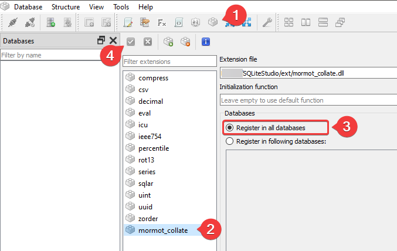
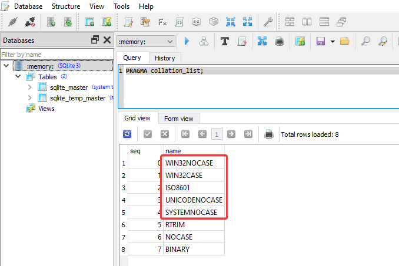

# mORMot Collation Extension for SQLite3

This SQLite3 extension adds support for **collations used by the mORMot framework**, making it possible to work with mORMot-created databases in third-party applications.

## Why It's Needed

By default, mORMot uses the `SYSTEMNOCASE` collation for `RawUTF8` fields. Without this extension, any operation that requires string comparison (e.g., `VACUUM`, certain `SELECT` or `UPDATE` queries) will fail with the following error:

```
no such collation sequence: SYSTEMNOCASE
```

This effectively prevents you from performing many operations on mORMot databases unless the required collations are available.

## Features

This extension adds the following collations:

- `WIN32CASE`
- `WIN32NOCASE`
- `SYSTEMNOCASE`
- `UNICODENOCASE` (introduced in mORMot2)
- `ISO8601`

These collations mirror the behavior expected by mORMot-based applications and ensure compatibility with mORMot's database structures.

## Installation & Usage

### For the SQLite3 Command-Line Utility

1. Place `mormot_collate.dll` in the same folder as `sqlite3.exe`.
2. Run the utility and open the target database.
3. Load the extension with the following command:

```
.load mormot_collate.dll
````

### For SQLiteStudio

1. Copy `mormot_collate.dll` into the `ext` folder inside your SQLiteStudio installation directory.
2. Launch SQLiteStudio.
3. Open the **Extension Manager**.
4. Select `mormot_collate` from the list of available extensions.
5. Check **Register in all databases**.
6. Save changes.

## Verification

To check that the collations have been loaded successfully, run:
```sql
PRAGMA collation_list;
````

This should return a list including the newly added mORMot collations.





